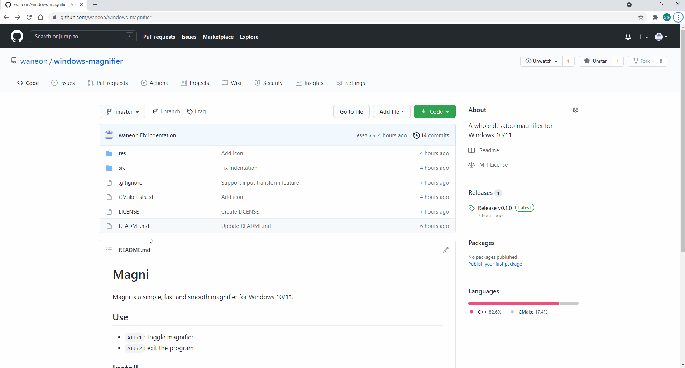

# Magni
Magni is a simple, fast and smooth magnifier for Windows 10/11.

Cursor position has an error in the screenshot, but there isn't in practice.

## Use
* `Alt+1`: toggle magnifier

## Install
#### 1. [Download](https://github.com/waneon/windows-magnifier/releases/latest) Magni.exe and Magni_cert.cer
#### 2. Install Magni_cert.cer "Trusted Root Certification Authorities" of the local machine.
#### 3. Place Magni.exe to the secure locations
* \Program Files\ subdirectoreis
* \Program Files (x86)\ subdirecotries
* \Windows\system32\ subdirectories